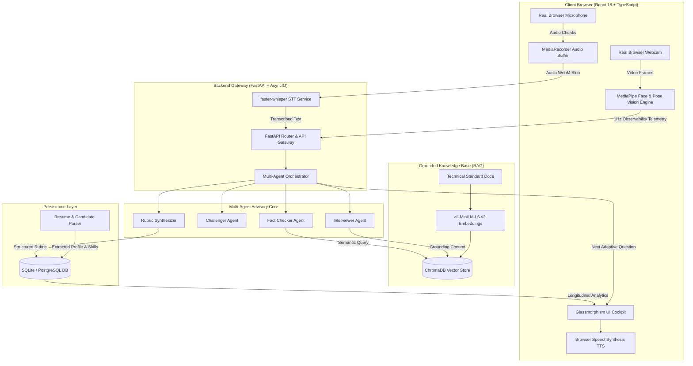
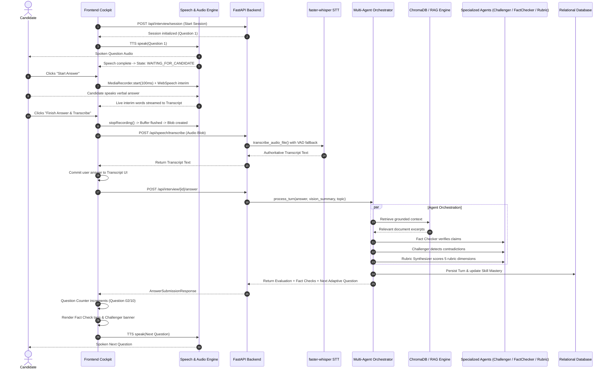
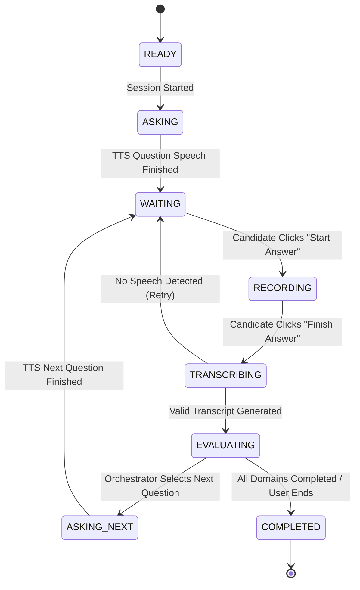

# MASTER AI — System Architecture & Technical Specification

**Project**: MASTER AI  
**Subtitle**: Autonomous AI Interview & Debate Platform  
**Architecture Version**: 2.0 (Stages 1–6 Production Architecture)  

---

## 1. High-Level Architectural Overview

MASTER AI is an autonomous, multimodal, multi-agent platform designed for high-pressure technical interviews, adversarial debates, and objective rubric evaluations. The system operates on a decoupled client-server architecture:

- **Frontend Client**: React 18 + TypeScript + Vite, featuring a dark glassmorphism SaaS cockpit, real-time Web Audio API & MediaRecorder pipelines, MediaPipe computer vision tracking, browser TTS speech synthesis, and live state visualization.
- **Backend Server**: FastAPI (Python 3.11+ / 3.13+), orchestrating faster-whisper speech-to-text inference, multi-agent adversarial evaluation (Interviewer, Challenger, Fact Checker, Rubric Synthesizer), semantic RAG grounding via ChromaDB & HuggingFace sentence transformers, candidate resume parsing, and relational persistence.

---

## 2. Autonomous Interview Turn Lifecycle

The interview operates as a deterministic, non-blocking asynchronous state machine ensuring synchronized speech, vision capture, evaluation, and question progression.

---

## 3. Finite State Machine (FSM)

The platform enforces a single authoritative interview state machine across the application:

---

## 4. Multi-Agent Advisory Architecture

Rather than relying on a single monolith prompt, MASTER AI coordinates four decoupled specialized agents:

1. **Interviewer Agent**: Formulates domain-aligned Socratic questions tailored to the candidate's target role (e.g. SOC Analyst), resume skills, and active skill gaps.
2. **Challenger Agent**: Performs adversarial reasoning to probe assumptions, detect self-contradictions against earlier candidate statements, and generate targeted counter-questions.
3. **Fact Checker Agent**: Extracts technical claims (e.g., event codes, protocols, cipher suites, command syntaxes) and verifies them against indexed technical authorities (MITRE ATT&CK, NIST, RFCs).
4. **Rubric Synthesizer**: Independently scores five observable dimensions:
   - **Knowledge Correctness** (40%)
   - **Reasoning Depth & Logic** (25%)
   - **Communication Clarity** (15%)
   - **Adaptability to Probes** (10%)
   - **Multimodal Presentation & Cadence** (10%)

---

## 5. Multimodal Vision & Presentation Telemetry

1. **Zero Raw Video Retention**: No video frames or images are ever stored on disk or sent over the network.
2. **Edge Signal Processing**: MediaPipe Tasks Vision extracts observable geometrical landmarks inside the browser at ~8 FPS.
3. **Extracted Observables**:
   - Camera engagement index (0–100%)
   - Head orientation (Yaw, Pitch, Roll angles)
   - Posture alignment consistency (Upright, Slouching, Lateral Lean)
   - Lighting & Framing quality scores
4. **1Hz Bounded Telemetry Buffer**: Buffered locally and converted to a per-turn `AnswerVisionSummary` submitted asynchronously upon answer completion.

---

## 6. Security Hardening & Prompt Injection Defense

1. **Untrusted Data Boundaries**: Candidate answers, resume text, job descriptions, and retrieved RAG document chunks are treated as untrusted data and wrapped in boundary tags:
   - `<candidate_untrusted_input>`
   - `<retrieved_evidence>`
2. **Path Traversal Protection**: Uploaded filenames are sanitized through `sanitize_filename()` to strip `../`, null bytes, and non-whitelisted characters.
3. **File Upload Security**: Enforces `MAX_UPLOAD_MB=10` and MIME validation (`.pdf`, `.txt`, `.md`), rejecting executables (`.exe`, `.sh`, `.bat`).
4. **Sanitized Logging**: Strict log sanitization ensures no API keys, tokens, or candidate personal identifiers are ever written to stdout or logs.

---

## 7. Demo Mode Isolation Architecture

- **Deterministic Fixture**: SOC Analyst Cybersecurity scenario with 4 pre-computed turns containing realistic Whisper STT output, MediaPipe vision metrics, RAG evidence, fact-checks, challenger probes, and rubric scores.
- **Strict Data Isolation**: Demo sessions are explicitly marked `is_demo = true`. Demo evaluations bypass candidate PostgreSQL/SQLite tables and do not alter real candidate skill mastery or practice recommendations.
- **Demo Reset**: `POST /api/demo/reset` safely flushes demo caches without affecting real user records.
